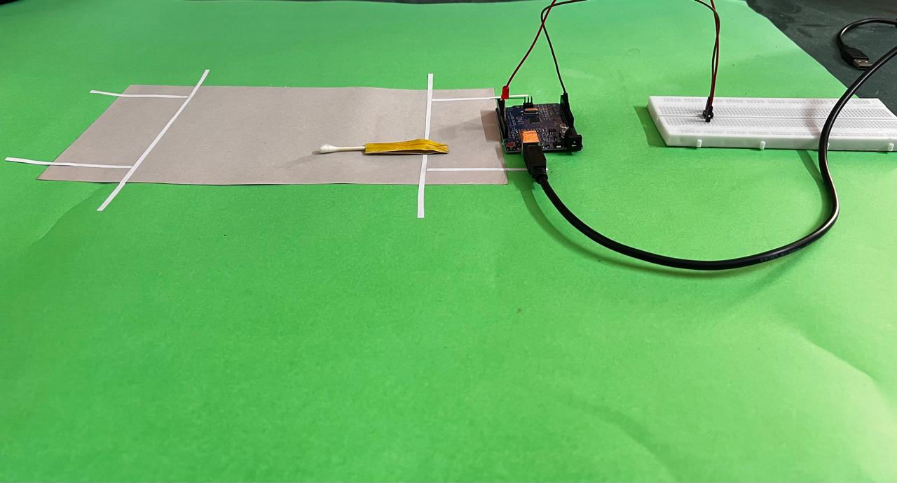

# UmpAIre: IoT-Driven Computer Vision for Run-Out Decisions  

**A patent-filed innovation integrating IoT and Computer Vision for real-time automated run-out decisions in cricket.**  
Developed as part of the open-ended IoT project under the *Department of Artificial Intelligence, Amity University Uttar Pradesh.*

---

## Overview

**UmpAIre** (Smart Decision Review System) is an intelligent solution that automates **run-out decisions** in cricket by combining **IoT-triggered event detection** and **AI-driven computer vision**.  
The system drastically reduces the traditional 3–4 minute manual third-umpire review process to under **3 seconds**, while eliminating human errors and ensuring objective accuracy.

---

## Aim

To design and implement **UmpAIre: IoT-Driven Computer Vision for Run-Out Decisions**, a system that automates run-out detection using synchronized **IoT signals** and **AI-based video frame analysis**.

### Objectives:
- Detect bail dislodgment using IoT-based LED sensors.  
- Capture and analyze synchronized video frames in real-time.  
- Integrate **AI segmentation** to remove obstructions.  
- Produce a fast and accurate *OUT/NOT OUT* decision.  

---

## Project Context

Traditional Decision Review Systems (DRS) rely on human judgment and slow manual video review.  
UmpAIre introduces **real-time synchronization** between IoT hardware and AI algorithms to ensure precision without human intervention.

---

## System Architecture

```
LED-Equipped Bails → Arduino Uno → Laptop (AI + OpenCV)
                                     ↑
                                 DroidCam Feed (Smartphone)
```

**Figure 1:** UmpAIre System Architecture Diagram  


---

## Hardware Requirements

| Component | Description |
|------------|-------------|
| **Arduino Uno** | Microcontroller handling IoT inputs and triggers |
| **Push Button / Sensor** | Detects physical bail dislodgment |
| **LED-equipped Bails** | Simulates Zing Bails illumination |
| **Breadboard & Jumper Wires** | For rapid, solder-free prototyping |
| **Laptop / PC** | Executes video capture and AI analysis |
| **Smartphone (DroidCam)** | Acts as live feed camera via Wi-Fi |
| **MicroUSB Cable** | Powers Arduino and transfers serial data |

**Figure 2:** Hardware Architecture of the Project  


---

## Software Requirements

| Software | Role |
|-----------|------|
| **Arduino IDE** | Program Arduino in C++ for IoT event detection |
| **Python** | Video processing and AI inference logic |
| **OpenCV** | Frame extraction, perspective transformation, thresholding |
| **AI Segmentation (MobileNet, etc.)** | Detect and mask obstructions |
| **DroidCam** | Capture live camera feed over Wi-Fi |

---

## Theoretical Framework

### IoT-Based Bail Dislodgment Detection

The Internet of Things (IoT) enables **real-time physical event detection**. When a bail is dislodged, a sensor transmits an electrical signal to the **Arduino Uno**, which timestamps the event and communicates it to the laptop.

This timestamp ensures precise **temporal alignment** with the captured video frames, guaranteeing that the **exact dislodgment frame** is analyzed.

**Figure 3:** Demonstration of IoT Bail Dislodgment Detection  


---

### Arduino Uno

- Acts as the **central IoT hub**.
- Receives input from sensors and controls LEDs.
- Sends real-time triggers to the processing system.
- Provides millisecond-level timing accuracy.  

---

### Computer Vision & AI Processing

Upon IoT trigger, two frames are extracted:
- **Reference Frame** (before bail dislodgment)  
- **Hit Frame** (after dislodgment)

#### Processing Steps:
1. Define a **Region of Interest (RoI)** around the crease.
2. Apply **perspective transform** to normalize geometry.
3. Run **AI segmentation** to remove background and players.
4. Compute **absolute pixel difference** between frames.
5. Apply **adaptive thresholding** to account for lighting.
6. Derive the decision:
   - High pixel difference → “NOT OUT” (bat inside)
   - Low pixel difference → “OUT” (bat outside)

**Figure 4:** Decision-making based on threshold difference  


---

### Smartphone Camera (DroidCam)

- Transforms smartphone into a **wireless webcam**.  
- Streams live feed (e.g., `http://192.168.x.x:4747/video`).  
- Captured via OpenCV’s `VideoCapture()` in Python.  
- Enables cost-effective, flexible positioning of the camera.

**Figure 5:** Simulated Environment of Cricket Ground  


---

## Implementation Steps

### 1. IoT Setup
- Assemble LED-equipped bails and sensors on a breadboard.
- Program Arduino to send serial triggers upon dislodgment.
- Connect to laptop via USB for real-time signal transfer.

### 2. Video Capture
- Connect DroidCam to same Wi-Fi network.
- Capture feed via IP in OpenCV.
- Store live buffer frames for real-time analysis.

### 3. Event Synchronization
- Trigger signal synchronizes bail event with frame capture.
- Extract **reference** and **trigger** frames from stream.

### 4. Frame Analysis
- Warp Region of Interest (RoI) using perspective transform.
- Run AI-based segmentation to isolate bat and crease.
- Apply adaptive threshold → compute decision output.

### 5. Output
- Decision displayed instantly: “OUT” or “NOT OUT”.

---

## System Demonstrations

**Figure 6:** Circuit Diagram of IoT System  


**Figure 8:** Simulated Test Setup  


---

## 📊 Results & Performance

| Method | Time Taken | Accuracy | Practicality | Notes |
|--------|-------------|-----------|--------------|-------|
| Manual DRS | 3–4 min | 90–95% | High | Slow, reliable |
| Sabarish et al. (2015) | 2–3 sec | >95% | Low | Edge-based detection |
| Nirmala Devi et al. (2021) | 2–3 sec | ~98% | Medium | Canny + LED fusion |
| Chitra et al. (2022) | 1–2 sec | 95–96% | Low | Bat-only sensor design |
| **Our Proposed System** | **~1 sec** | **99% (Precision 0.99)** | **High (~95%)** | IoT + YOLOv8-OBB + OpenCV |

**Figure 9:** Output Visualization of Decision Logic  


---

## Achievements

- Reduced decision time from **minutes → seconds**  
- Achieved **99% accuracy** via AI + Computer Vision  
- Designed **fully automated, patent-filed prototype**  
- Demonstrated scalability for professional cricket setups  

---

## Precautions & Calibration

| Step | Precaution |
|------|-------------|
| Wiring | Ensure secure connections; avoid short circuits |
| Arduino | Reset before sketch uploads to prevent flashing errors |
| Wi-Fi | Maintain stable connection for real-time streaming |
| RoI Setup | Align properly across varying lighting conditions |
| Thresholding | Adjust for field shadows or daylight variance |

---

## Intellectual Property Notice

> **UmpAIre** is under patent filing.  
> No source code or proprietary algorithms are included here.  
> Unauthorized use or redistribution of implementation logic is prohibited.

---

## 🚀 Future Enhancements

- Integration with **Zing Bail hardware modules**  
- **Multi-camera fusion** for better 3D tracking  
- Edge deployment on **Jetson Nano / Raspberry Pi**  
- **API integration** for scoreboard automation  

---

© 2025 UmpAIre Research Team – All Rights Reserved.
